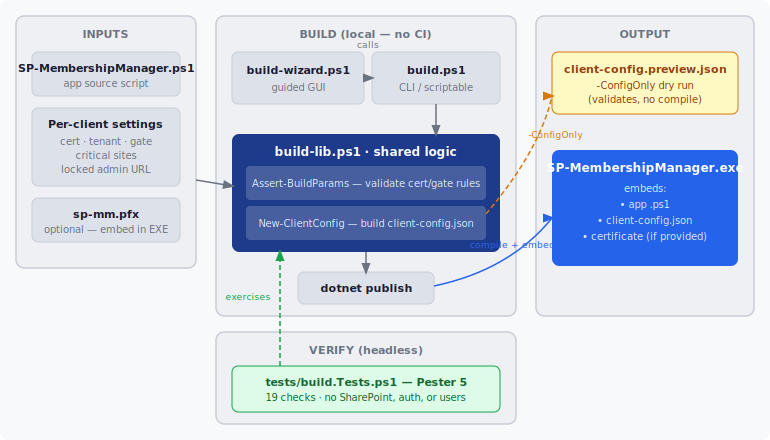

# Building SP-MembershipManager

This guide walks you through turning the source code into a single `SP-MembershipManager.exe` you can hand to a client. No prior experience with .NET or PowerShell packaging is assumed — if you can copy, paste, and fill in a few boxes, you can build it.

There are two ways to build:

- **[The Build Wizard](#option-a-the-build-wizard-recommended)** — a point-and-click window. **Start here** if you just want an EXE and don't want to think about command-line flags.
- **[The command line](#option-b-the-command-line)** — `build.ps1` with parameters. Use this for scripting, repeatable builds, or if you prefer typing.

Both produce the **same** result. The wizard just fills in the command line for you.



> **Heads up — builds are local.** This project is **not** built by GitHub Actions anymore, and the artifact on the Actions tab is a **gate-less** build (no sign-in restriction). Do not distribute it. Always build the EXE yourself using this guide so the per-client settings (and the sign-in gate) are baked in correctly.

---

## Before you start (one-time setup)

You need three things on your machine:

| Requirement | How to check | How to get it |
|-------------|--------------|---------------|
| **Windows 10 or 11** | You're on it | — |
| **PowerShell 7+** | Run `pwsh --version` | [Install PowerShell 7](https://learn.microsoft.com/powershell/scripting/install/installing-powershell-on-windows) |
| **.NET 8 SDK** | Run `dotnet --version` (expect `8.x`) | [Download the .NET 8 SDK](https://dotnet.microsoft.com/download/dotnet/8.0) — get the **SDK**, not just the Runtime |

> **`dotnet --version` says it's not recognized?** The SDK isn't installed (or your terminal was open before you installed it — close and reopen it). The build will stop early with a clear message if `dotnet` is missing.

Open a PowerShell 7 terminal (`pwsh`) and `cd` into the project folder before running any command below.

---

## Option A: The Build Wizard (recommended)

1. In the project folder, run:

   ```powershell
   .\build-wizard.ps1
   ```

2. A window titled **SP-MembershipManager Build Wizard** opens. Fill in the boxes you need (every box is optional — leave a box blank to skip that feature). See **[What each setting means](#what-each-setting-means)** below for plain-language explanations.

3. Click **Build**. Progress appears in the black output box at the bottom.

4. When it says **Done**, your EXE is at:

   ```
   build\output\SP-MembershipManager.exe
   ```

The wizard checks your settings before building and will warn you about common mistakes — for example, if you fill in only one of the two sign-in-gate boxes, or if you're about to build with **no** sign-in gate at all.

---

## Option B: The command line

The simplest possible build (no per-client settings baked in):

```powershell
.\build.ps1
```

The EXE lands at `build\output\SP-MembershipManager.exe`. A plain build like this still needs an `app-config.json` and a `.pfx` certificate sitting next to it at runtime (see [Deploying](README.md#deploying-to-a-new-tenant)).

To bake in per-client settings, add parameters:

```powershell
.\build.ps1 `
    -CertPath ".\sp-mm.pfx" `
    -CertPassword "your-pfx-password" `
    -Tenant "contoso.onmicrosoft.com" `
    -LockedAdminUrl "https://contoso-admin.sharepoint.com" `
    -GateClientId "<gate-app-client-id>" `
    -GateGroupId  "<entra-group-object-id>"
```

### Parameter reference

| Parameter | What it does | Example |
|-----------|--------------|---------|
| `-LockedAdminUrl` | Pre-fills **and locks** the SharePoint admin URL so the user can't point the tool at a different tenant. | `https://contoso-admin.sharepoint.com` |
| `-CertPath` | Embeds the `.pfx` certificate **inside the EXE** so no external cert file is needed. Requires `-CertPassword` and `-Tenant`. | `.\sp-mm.pfx` |
| `-CertPassword` | The password for that `.pfx`. Required when `-CertPath` is set. | `"s3cret"` |
| `-Tenant` | Your tenant name. Required when `-CertPath` is set. | `contoso.onmicrosoft.com` |
| `-GateClientId` | Client ID of the sign-in-gate app registration. **Must be paired with `-GateGroupId`.** | `f4840136-…` |
| `-GateGroupId` | Object ID of the Entra group allowed to use the tool. **Must be paired with `-GateClientId`.** | `0b654d3a-…` |
| `-GateRequestContact` | Email or URL shown on the *Access Denied* dialog so a blocked user can request access. | `it-help@contoso.com` |
| `-CriticalSiteUrls` | One or more sites to flag as sensitive (red row; managing them is restricted). | `@("https://contoso.sharepoint.com/sites/HR")` |
| `-CriticalSiteGroupId` | Entra group whose members are allowed to manage the critical sites above. | `a1b2c3d4-…` |
| `-ConfigOnly` | **Dry run** — validate settings and write the generated config without compiling. See [Preview your settings](#preview-your-settings-without-a-full-build). | *(switch, no value)* |

> Run `Get-Help .\build.ps1 -Detailed` for the full built-in documentation.

---

## What each setting means

**Certificate (embed in EXE)** — Normally the EXE reads its certificate from a `.pfx` file placed next to it. If you supply the certificate at build time (`-CertPath` + `-CertPassword` + `-Tenant`, or the Certificate boxes in the wizard), the cert is baked **inside** the EXE and the client gets a single self-contained file with nothing else to copy. Convenient — but see the [security note](#security-the-embedded-certificate-build).

**Tenant Lock (Locked Admin URL)** — Forces the EXE to a specific tenant. The admin-URL prompt still appears at launch, but it's pre-filled and read-only, so the user can't retarget the tool somewhere else.

**Sign-In Gate** — By default, anyone who can launch the EXE inherits its SharePoint access. The gate closes that gap: it makes each user sign in interactively and only lets them through if they belong to an Entra security group you choose. **You provide both** the gate app's Client ID **and** the group's Object ID — providing only one is rejected (a half-configured gate would fail at startup). Setting up the gate app registration is a one-time Azure task documented in the [README](README.md#restricting-who-can-use-the-app-sign-in-gate).

**Critical Sites** — Sites you mark as sensitive show up with a red background, and only members of the *Critical Site Group* can add/remove access on them. Everyone else sees the buttons disabled with a "contact an administrator" note.

---

## Preview your settings without a full build

A full compile takes a minute or two. When you only want to confirm your **settings** are baked correctly, do a dry run:

```powershell
.\build.ps1 -GateClientId "abc" -GateGroupId "def" -ConfigOnly
```

This validates the parameters and writes the generated configuration to `build\output\client-config.preview.json` **without** compiling. Open that file to confirm the right values are present. Nothing is deployed and the real build is untouched.

---

## Verifying your build

**Fast automated check (seconds, no SharePoint needed).** A headless test suite verifies the build logic — validation rules and that your settings get baked in correctly. It never connects to a tenant or touches any user:

```powershell
Invoke-Pester -Path .\tests\build.Tests.ps1 -Output Detailed
```

(First time only: `Install-Module Pester -Scope CurrentUser` — needs Pester 5+.)

**Full behavior check (manual).** To confirm the EXE actually behaves correctly when launched — sign-in gate, red critical-site rows, add/remove — walk through [docs/ACCEPTANCE-TESTS.md](docs/ACCEPTANCE-TESTS.md). Each test there is tagged 🟢 (covered by the automated suite) or 🔴 (needs a manual run against a live tenant).

---

## Troubleshooting

**`dotnet not found. Install the .NET 8 SDK…`**
The .NET 8 **SDK** isn't installed, or you opened the terminal before installing it. Install it from the link in [Before you start](#before-you-start-one-time-setup), then close and reopen your terminal.

**Build fails with `MSB4018` or "file is in use" / "being used by another process"**
A copy of `SP-MembershipManager.exe` is still running and is locking the output file. Close every running instance (check the Task Manager) and build again.

**`-GateClientId was supplied without -GateGroupId…` (or vice-versa)**
The sign-in gate needs **both** IDs or **neither**. Supply the missing one, or remove both to build without a gate.

**"Windows protected your PC" appears the first time the EXE runs**
This is SmartScreen, not an error — it shows for any unsigned EXE, especially one copied from another machine. Click **More info → Run anyway** (once per machine). Signing the EXE removes this.

**Windows Defender flags the EXE after building**
This is a known false positive for executables that embed and run scripts. Add a Defender exclusion for it. See [Code Signing](README.md#code-signing) in the README for both first-run prompts (SmartScreen + the antivirus exclusion) and the signing status.

---

## Security: the embedded-certificate build

When you bake a certificate into the EXE (`-CertPath`), the private key **and** its password live inside the EXE binary. **That EXE is now exactly as sensitive as the `.pfx` file itself.** Treat it accordingly:

- Don't email it, post it in chat, or drop it in shared storage that the wrong people can reach.
- Hand it to the client over a secure channel.
- A **gate-less** embedded-cert build means anyone who gets the file can use the tool's full SharePoint access — strongly prefer pairing an embedded cert with the sign-in gate.

---

## What to deploy

| Build type | Files the client needs |
|------------|------------------------|
| **Self-contained** (built with `-CertPath`) | Just `SP-MembershipManager.exe` |
| **Plain** (no embedded cert) | `SP-MembershipManager.exe` + `app-config.json` + the `.pfx` certificate, all in one folder |

See [Deploying to a new tenant](README.md#deploying-to-a-new-tenant) in the README for the first-run admin-consent step.
