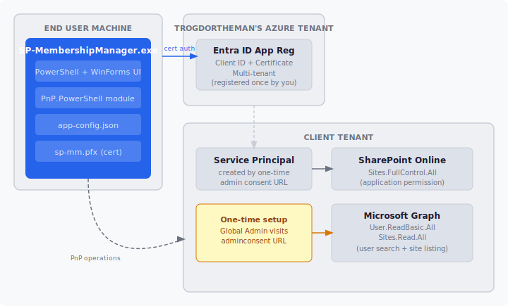

# SP-MembershipManager

A Windows GUI tool that lets authorized users manage SharePoint Online site membership without needing SharePoint admin training. Point it at any Microsoft 365 tenant and it handles the rest.

## What it does

- Search for any employee by name or email
- See every SharePoint site they have access to and what role they hold
- Add them to a site as Owner, Member, or Visitor
- Remove them from a site
- Logs every action to `C:\temp\SP-MembershipManager\Logs\`

## Architecture



## Requirements

- Windows 10/11
- PowerShell 7+
- [PnP.PowerShell](https://pnp.github.io/powershell/) (installed automatically on first run)

No SharePoint Administrator role is required for the end user running the tool. Authentication is handled via an app-only service principal with pre-granted permissions.

Startup shows a loading screen while the tool connects and fetches the site list in the background, so the main window opens ready to use.

The certificate password in `app-config.json` is encrypted with Windows DPAPI on first run and replaced with a ciphertext blob. The plaintext password never persists on disk after that point. Encryption is tied to the Windows user account that performed the first run — the password cannot be decrypted by a different user or on a different machine.

Site membership lookups run in parallel (up to 8 concurrent connections) using PowerShell runspaces, keeping scan times low even across large tenants. The UI stays responsive during scans.

## Running from source

Before running, make sure `app-config.json` and `sp-mm.pfx` are in the same directory as the script. Copy `app-config.example.json` to `app-config.json` and fill in your tenant details.

```powershell
.\SP-MembershipManager.ps1
```

A dialog will prompt for your SharePoint Admin URL (e.g. `https://yourtenant-admin.sharepoint.com`).

## Building a standalone .exe

Every push to `main` and every release is built automatically by GitHub Actions. Download the artifact from the [Actions tab](https://github.com/TrogdorTheMan/SP-MembershipManager/actions) or grab the `.exe` attached to any [release](https://github.com/TrogdorTheMan/SP-MembershipManager/releases).

To build locally, install the [.NET 8 SDK](https://dotnet.microsoft.com/download) and run:

```powershell
.\build.ps1
```

The compiled executable is written to `build\output\SP-MembershipManager.exe`. You will still need `app-config.json` and `sp-mm.pfx` in the same folder as the exe — see the Deploying section below. PnP.PowerShell is installed automatically on first run if not already present.

## Deploying to a new tenant

Place the following three files in the same folder:

- `SP-MembershipManager.exe` — download from the [Actions tab](https://github.com/TrogdorTheMan/SP-MembershipManager/actions) or a [release](https://github.com/TrogdorTheMan/SP-MembershipManager/releases)
- `app-config.json` — copy from `app-config.example.json` and fill in your tenant details; the `CertificatePath` field should be the filename of your pfx (e.g. `sp-mm.pfx`)
- `sp-mm.pfx` — the certificate for your Entra ID app registration (filename must match `CertificatePath` in `app-config.json`)

Before first use, a Global Admin in the target tenant needs to grant consent for the app. This is a one-time step per tenant.

Have the Global Admin visit this URL and sign in with their admin account:

```
https://login.microsoftonline.com/common/adminconsent?client_id=630f7dac-df2b-4586-a6b4-e83acbf4e91e&redirect_uri=https://login.microsoftonline.com/common/oauth2/nativeclient
```

They will see a consent prompt listing the permissions the app is requesting (SharePoint read/write across all sites, basic user directory access). After they click Accept, the tool will work for anyone in that tenant with no further setup.

## Using your own app registration

If you fork this repo, you can substitute your own multi-tenant Entra ID app registration. Register an app at [portal.azure.com](https://portal.azure.com) with:

- Supported account types: Accounts in any organizational directory (Multitenant)
- Application permissions: `SharePoint > Sites.FullControl.All`, `Microsoft Graph > User.ReadBasic.All`, `Microsoft Graph > Sites.Read.All`

Then replace `$script:AppClientId` near the top of `SP-MembershipManager.ps1` with your own Client ID, generate a certificate for your app registration, and update `app-config.json` with the cert path and your tenant name.

## Usage

See [USAGE.md](USAGE.md) for day-to-day usage instructions and known behaviors.

## Roadmap

- **Group membership expansion** — users who have access via an Entra ID security group (e.g. "SharePoint Power Users") are not currently detected; this will resolve group membership transitively and show "Member (via GroupName)" in the site access grid
- **First-run consent check** — detect when admin consent hasn't been granted in the target tenant and surface the consent URL directly in the error dialog
- **Critical site flagging** — designate sensitive sites in config so they render with a red background in the site access grid as a visual warning
- **Per-client build config** — bake a locked admin URL, critical site list, and feature flags into each compiled exe at build time so a client's exe can't be pointed at the wrong tenant
- **User auth gate** — MSAL interactive login on launch with M365 security group membership check, preventing unauthorized use if the exe reaches the wrong hands; group ID baked in per-client at build time

## Code Signing

An application for free code signing through the [SignPath Foundation](https://signpath.org) open source program was submitted on 2026-06-09 and is pending review. Once approved, releases will be signed.

Until signing is in place, Windows Defender may flag the executable as a false positive. This is a known issue with executables that embed and run scripts. To work around it, add a Defender exclusion for the exe after downloading:

**Windows Security → Virus & threat protection → Manage settings → Add or remove exclusions → Add file → select SP-MembershipManager.exe**

## License

MIT. See [LICENSE](LICENSE).
